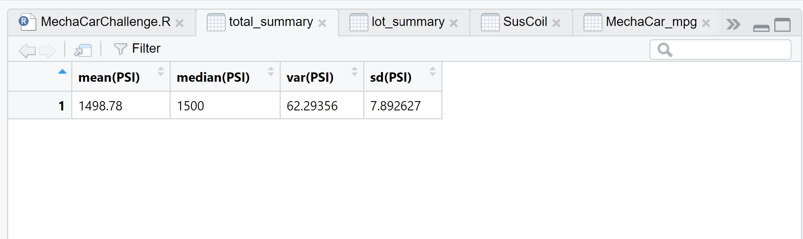
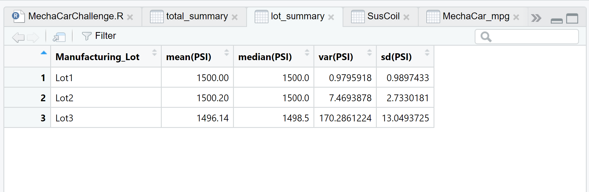
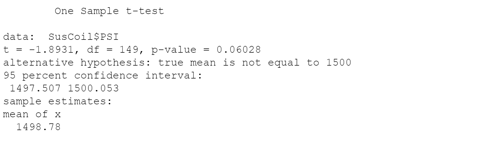
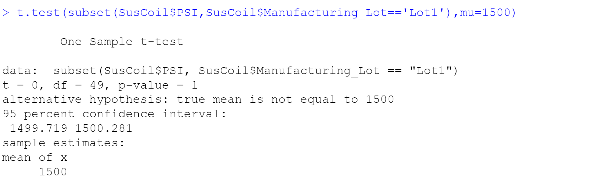
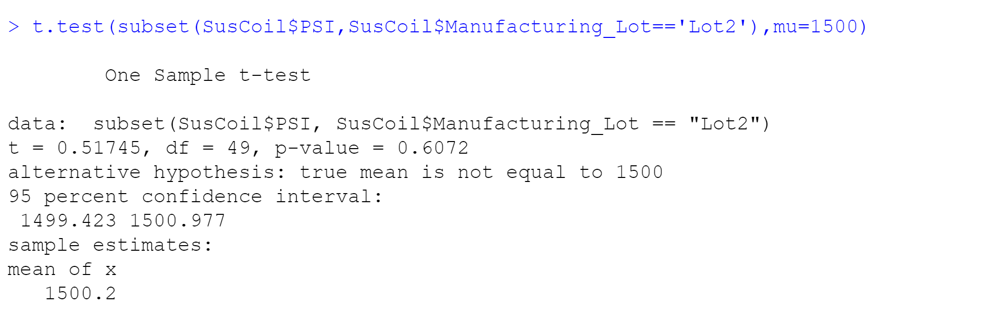
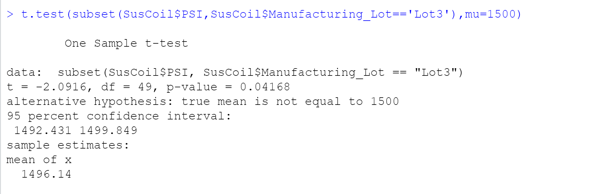

# MechaCar

> Statistics and hypothesis testing is used to analyze a series of datasets from the automotive industry using R programming language.

## Overview of Project

AutosRUs’ newest prototype, the MechaCar, is suffering from production troubles that are blocking the manufacturing team’s progress. AutosRUs’ upper management has called on Jeremy and the data analytics team to review the production data for insights that may help the manufacturing team.

- Perform multiple linear regression analysis to identify which variables in the dataset predict the mpg of MechaCar prototypes
- Collect summary statistics on the pounds per square inch (PSI) of the suspension coils from the manufacturing lots
- Run t-tests to determine if the manufacturing lots are statistically different from the mean population
- Design a statistical study to compare vehicle performance of the MechaCar vehicles against vehicles from other manufacturers. For each statistical analysis, you’ll write a summary interpretation of the findings.

## Summary

## Analysis and Challenges

### Linear Regression to Predict MPG

The MechaCar prototypes were produced using multiple design specifications to identify ideal vehicle performance. Multiple metrics, such as vehicle length, vehicle weight, spoiler angle, drivetrain, and ground clearance, were collected for each vehicle.

design a linear model that predicts the mpg of MechaCar prototypes using several variables from the MechaCar_mpg.csv file.

Which variables/coefficients provided a non-random amount of variance to the mpg values in the dataset?
Is the slope of the linear model considered to be zero? Why or why not?
Does this linear model predict mpg of MechaCar prototypes effectively? Why or why not?

```
# mpg = 6.27*vehicle_length + 0*vehicle_weight + 0.07*spoiler_angle + 3.55*ground_clearance - 3.41*AWD - 104
# From this formula we can already see that vehicle length and spoiler angle have
# no (or almost no) impact on the mpg of the vehicle so we can rewrite our model:
# mpg = 6.27*vehicle_length + 3.55*ground_clearance - 3.41*AWD - 104
```

### Summary Statistics on Suspension Coils

The MechaCar Suspension_Coil.csv dataset contains the results from multiple production lots. In this dataset, the weight capacities of multiple suspension coils were tested to determine if the manufacturing process is consistent across production lots.

Summary statistics

The suspension coil’s PSI continuous variable across all manufacturing lots
The following PSI metrics for each lot: mean, median, variance, and standard deviation.

```
# According to the summary output, the r-squared value of the multiple linear
# regression model is 0.71, which means that roughly 71% of all mpg predictions
# will be correct while using this regression model.
# In addition, the p-value of our linear regression is 5.35e-11, which is much smaller
# than our assumed significance level of 0.05. Therefore, we can state that there is
# sufficient evidence to reject our null hypothesis.
```





### T-Tests on Suspension Coils

Perform t-tests to determine if all manufacturing lots and each lot individually are statistically different from the population mean of 1,500 pounds per square inch.









### Study Design: MechaCar vs Competition

Short description of a statistical study that can quantify how the MechaCar performs against the competition. In your study design, think critically about what metrics would be of interest to a consumer: for a few examples, cost, city or highway fuel efficiency, horse power, maintenance cost, or safety rating.

In your description, address the following questions:

- What metric or metrics are you going to test?
- What is the null hypothesis or alternative hypothesis?
- What statistical test would you use to test the hypothesis? And why?
- What data is needed to run the statistical test?

## Todo Checklist

A helpful checklist to gauge how your README is coming on what I would like to finish:

- [ ] Fill Out.
- [ ] Finish Analysis

## Contributing

Pull requests are welcome. For major changes, please open an issue first to discuss what you would like to change.

Please make sure to update tests as appropriate.

## License

[MIT](https://choosealicense.com/licenses/mit/)
